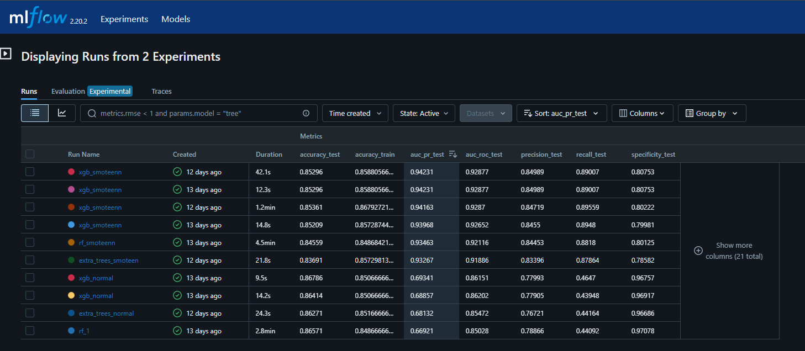
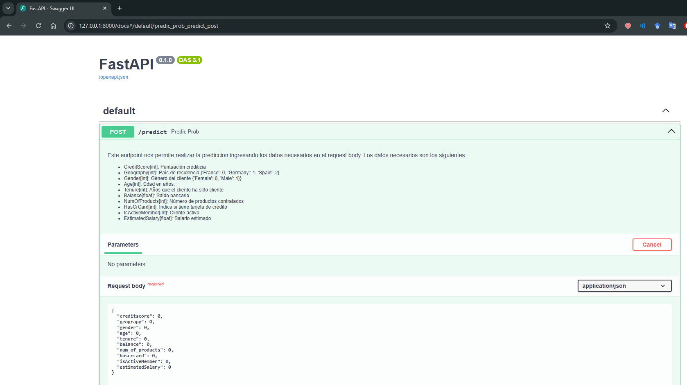

# laboratorio-machine-learning
API Simple que sirve un modelo para la prevención del Churn

## Tecnologías usadas
This API uses a number of open source projects to work properly:

* [Python] - Lenguaje de programación
* [FastApi] - Libreria minimalista para el provisionamiento de APIs
* [scikit-learn] - Libreria de aprendizaje automatico
* [MLFlow] - Libreria para el trackeo de los modelos de prueba entrenados
* [pickle] - Libreria para cargar y guardar variables en memoria

## Modelo ML
El modelo a usar en este proyecto es el que presento mejor performance de una serie de modelos entrenados. Se aplico un submuetreso a la clase mayoritaria y sobremuestreo a la calse minotiraria para asegurarnos que el modelo no overfitee en alguna de las clases. Los modelos entrenados se trackearon en el entorno de MLFlow




## Instalación Local
Esta API requiere Python y las librerias señaladas en el requirements.txt

1. Clonar repositorio
2. Correr la api, ejecutando desde la carpeta de proyecto activando el entorno virual con las librerias 
3. Comando:

```comand pront
fastapi dev
```

#### Verificar que la app esta corriendo exitosamente

La api se verifica abriendo la direccion http brindada al ejecutar el comando. De preferencia usar:

```
Documentation at http://127.0.0.1:8000/docs
```
Nos mostrara esta interfaz:



Ejemplos para probar la app

Ejemplo 1:
```json
{
  "creditscore": 619,
  "geograpy": 0,
  "gender": 0,
  "age": 42,
  "tenure": 2,
  "balance": 0.0,
  "num_of_products": 1,
  "hascrcard": 1,
  "isActiveMember": 1,
  "estimatedSalary": 101348.88
}

# Respuesta esperada:
{
  "respuesta": [0]
}
```

Ejemplo 2:
```json
{
  "creditscore": 608,
  "geograpy": 2,
  "gender": 0,
  "age": 41,
  "tenure": 1,
  "balance": 83807.86,
  "num_of_products": 1,
  "hascrcard": 0,
  "isActiveMember": 1,
  "estimatedSalary": 112542.58
}

# Respuesta esperada:
{
  "respuesta": [1]
}
```

#### Equipo

* Diego Alexander Chero Olazabal

#### Contribuir

Hacer fork del repositorio y mandar pull request con los cambios propuestos

